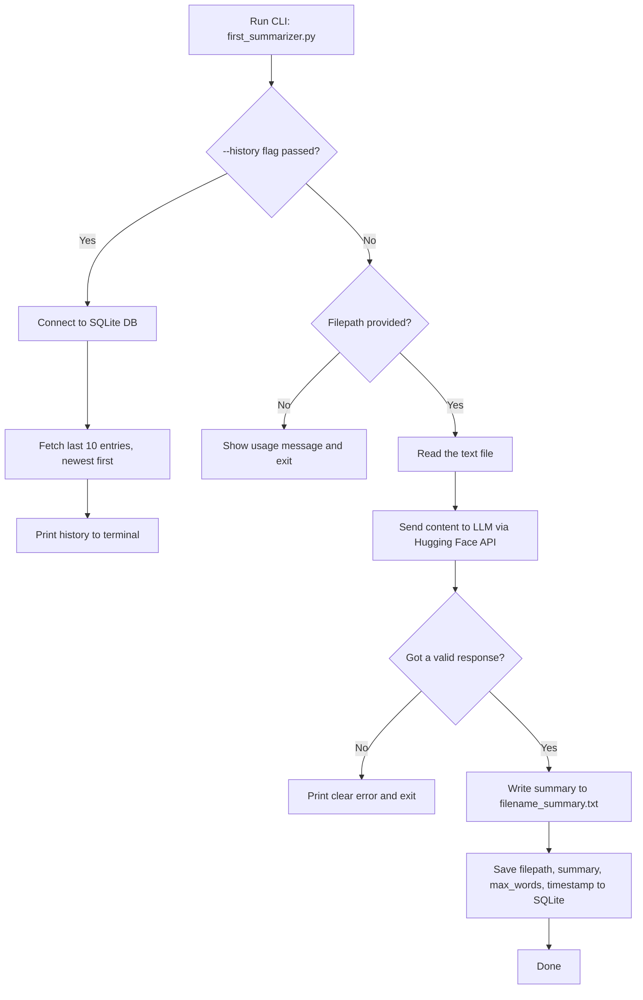

# 📖 Story Summarizer CLI

A small command-line tool that reads a text file, sends it to an LLM, and gives you back a clean summary — with history tracking in a local database.

I built this as my **first real Python project** while learning software fundamentals alongside ML/DL theory. It's intentionally simple, but every part of it — the error handling, the CLI design, the database layer — was built (and broken, and fixed) by me, one piece at a time.


---

## 🧠 Why I Built This

I built this project beacause I want to build my skill of creating AI based applications for that I have started something basic but in turn I made up the fundamentals that are necessary for one to understand. This project enables me to review my python knowledge along side using LLM model. Also with this small tool I touched different areas of knowledge and got a entry point to each specifically using AI models from hugging face, using argparse module of python to pass arguments from command line, I handled different types of exceptions and I also used simple database queries to help me start learning database systems by building something meaningful.
In this project I tried to look for different edge cases moreover I made this project with user experience in mind at every step I asked myself a question how will user interact with this tool and what if user interaction breaks the code what will the user experience this was a great experience for me.

---

## ⚙️ What It Does

- Takes any `.txt` file and generates a summary using an LLM (`google/gemma-2-2b-it` via Hugging Face's `featherless-ai` provider)
- Lets you control summary length with `--max-words`
- Saves every summary you generate into a local SQLite database
- Lets you view your last 10 summaries with `--history`
- Fails *loudly and clearly* instead of crashing with ugly tracebacks — every failure path (missing file, empty API response, bad permissions, network errors) is handled on purpose

---

## 🛠️ Tech Stack

| Tool | Why I used it |
|---|---|
| **Python** | Core language |
| **Hugging Face Hub (`InferenceClient`)** | To call the LLM for summarization |
| **SQLite3** | Local persistence — no server needed, perfect for learning databases |
| **argparse** | Proper CLI argument handling (positional + optional flags) |
| **python-dotenv** | Keeping my API token out of source code |
| **pathlib** | Clean, OS-independent file path handling |

---

## 🔄 How It Works



---

## 📁 Project Structure

```
story-summarizer-cli/
├── first_summarizer.py   # Main CLI tool — argument parsing, file I/O, API calls
├── db.py                 # SQLite layer — init_db, save_summary, get_history
├── story.txt              # Sample input file
├── story_summary.txt      # Example generated output
├── .gitignore             # Keeps .env and the database out of version control
└── README.md
```

---

## 🚀 Getting Started

**1. Clone it**
```bash
git clone https://github.com/MHammadSarwar/story-summarizer-cli.git
cd story-summarizer-cli
```

**2. Install dependencies**
```bash
pip install huggingface_hub python-dotenv
```

**3. Add your Hugging Face token**

Create a `.env` file in the project root:
```
HF_TOKEN=your_token_here
```

**4. Run it**
```bash
# Basic usage
python first_summarizer.py story.txt

# Control summary length
python first_summarizer.py story.txt --max-words 100

# View your summary history
python first_summarizer.py --history
```

---

## 📚 What This Project Actually Taught Me

This list matters more to me than the code itself:

- **Errors caught ≠ errors handled.** Catching an exception and printing it is not the same as deciding what the program should actually *do* next — I learned this the hard way with a `None` value silently crashing a later line.
- **`sys.argv` before `argparse`.** I forced myself to understand the raw mechanism before reaching for the abstraction, so `argparse` clicked instead of feeling like memorized syntax.
- **Connections vs. cursors in SQLite** — and why a cursor isn't "tied" to whatever query created a table; it's just a disposable tool for talking through the connection.
- **Never build SQL strings with f-strings.** Parameter placeholders (`?`) exist specifically to prevent SQL injection — and once you understand *why*, you never go back to string formatting for queries.
- **`(x)` is not a tuple. `(x,)` is.** A genuinely classic Python gotcha I had to hit myself to actually remember.
- **Secrets don't go in git, ever — not even on private repos.** Set up `.gitignore` *before* the first commit, not after.
- **Code that works ≠ code you understand.** I made it a rule for this project: if I couldn't explain why a line existed, I wasn't allowed to leave it in.

---

## 🔭 What I'd Add Next

- Proper retry logic with exponential backoff for API failures
- A `--limit` flag for `--history` instead of a hardcoded 10
- Tests for the failure paths I currently only check by hand
- Maybe a switch to PostgreSQL once I've outgrown what SQLite is good for

---

*Built while learning to actually understand the code I write, not just get it to run.*
